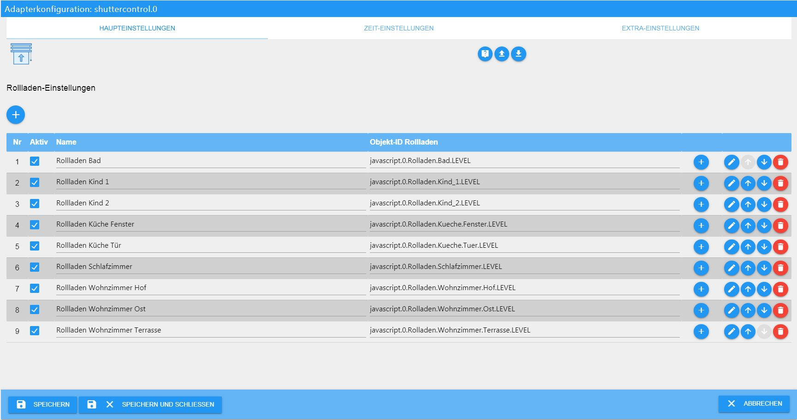
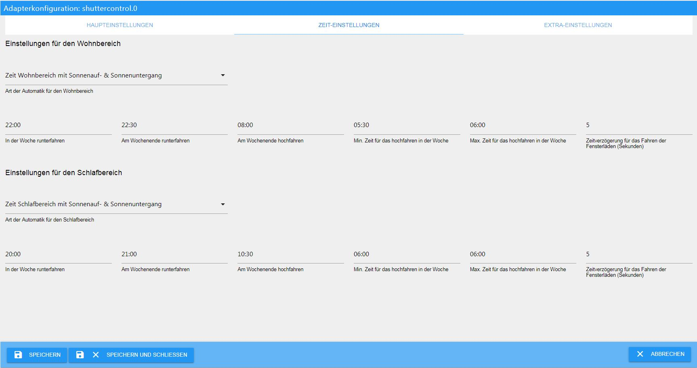
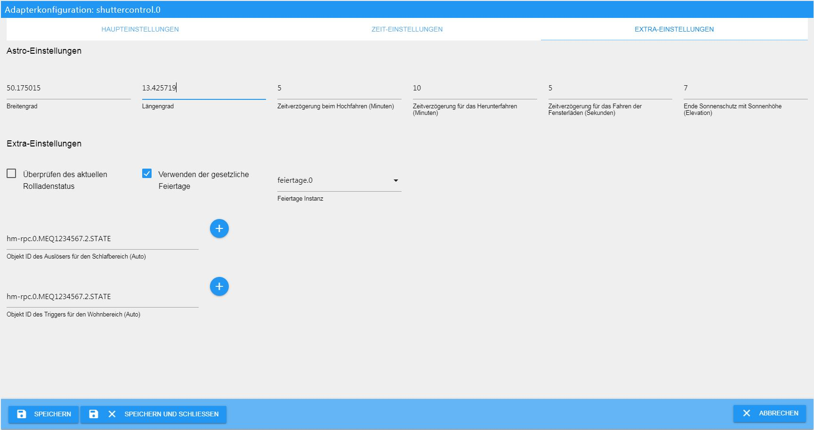

## Shuttercontrol ist ein Adapter zur automatischen Steuerung von Rollläden und Markisen.

# Grundlegendes
Ab der Version 0.2.11 sind alle Konfigurationsdatenpunkte bereits mit Beispielen voreingestellt, so dass der Adapter nach Installation 
und Eingabe von den IDs der Rollladenaktoren betriebsbereit ist.
Die weitere Konfiguration dient dann der Anpassung an persönliche Wünsche.

## Installation
Der Adapter befindet sich bereits im latest Repository. Um ihn installieren zu können muss man in den Grundeinstellungen von ioBroker 
sein aktives Repository (vorübergehend) auf latest stellen.

Spätestens nach Refresh der Adapterliste steht der Adapter **Shuttercontrol** zur Verfügung.

Nach anklicken des (+) wird eine Instanz angelegt und die notwendigen Daten des Adapters vom Repository geladen:

# Konfiguration - Haupteinstellungen
Sollte in dem Installationsfenster die Checkbox "***schließen wenn fertig***" nicht angehakt sein muss man dieses natürlich noch schließen.

Das Konfigurationsfenster besteht aus drei Reitern:
* Haupteinstellungen
* Zeit-Einstellungen
* Extra-Einstellungen

Das Konfigurationsfenster öffnet sich automatisch mit den Haupteinstellungen

Auf dieser Seite ist eine Beispiel-ID abgelegt.
Diese bitte löschen und anschließend die eigenen IDs durch anklicken des (+) links oben an der Tabelle die eigenen Rollladenaktoren hinzufügen

Dabei bitte die Datenpunkte mit LEVEL (o.ä.) auswählen. NICHT das Gerät als solches.

Nach Abschluß der ID-Auswahl ist der Adapter bereits betriebsbereit, aber noch nicht an die eigenen Wünsche angepasst.

### Aufbau der Tabelle
 **Nr**:  fortlaufende Nummer der gelisteten Rollläden

**Aktiv**: Checkbox zur Aktivierung der Steuerung des entsprechenden Rollladens

**Name**: Name des Aktors; wird bei der Auswahl der ID automatisch aus den Objekten eingelesen

**Objekt-ID Rollladen**: Eindeutige ID des zu steuernden Datenpunkts in den Objekten

**(+)**: Hinzufügen/Ändern der ID

**Bleistift**: spezifische Konfiguration des jeweiligen Rollladens

**Pfeile**: verändern der Reihenfolge der verschiedenen Rollläden

**Mülleimer**: Löschen der ID mit allen Konfigurierten Daten!

## individuelle Konfiguration eines Rollladens
Auch diese Konfigurationsebene besteht aus zwei Reitern: Haupteinstellungen und Sonnenschutzeinstellungen

### Haupteinstellungen

Im oberen Bereich werden die Zeitpunkte für das Hoch und Runterfahren zur nächtlichen Verdunklung festgelegt.
Diese Zeiten können im Reiter ***Zeit-Einstellungen*** konfiguriert und hier aus dem Pulldown-Menü ausgewählt werden.

---
#### Zeitvorgaben
* **Aus:** keine Vorlagen verwenden
* **Wohnbereich:** Die Rollläden werden wie in dem Menüpunkt Zeiteinstellungen/Wohnbereich konfiguriert gefahren.
* **Wohnbereich (AUTO):** Die Rollläden werden wie in dem Menüpunkt Zeiteinstellungen/Wohnbereich konfiguriert gefahren. 
Zusätzlich wird auf den unter Extra-Einstellungen festgelegten Trigger geachtet. Steht dieser auf false werden die Rollläden
 nicht automatisch gefahren
* **Schlafbereich:** Die Rollläden werden wie in dem Menüpunkt Zeiteinstellungen/Schlafbereich konfiguriert gefahren.
* **Schlafbereich (AUTO):** Die Rollläden werden wie in dem Menüpunkt Zeiteinstellungen/Schlafbereich konfiguriert gefahren. 
Zusätzlich wird auf den unter Extra-Einstellungen festgelegten Trigger geachtet. Steht dieser auf false werden die Rollläden 
nicht automatisch gefahren
* **Sonnenuntergang:** Die Rollläden werden bei Sonnenuntergang auf die Verdunklungsstufe gefahren (bei hochfahren 
steht hier analog der Sonnenaufgang)
* **Sonnenhöhe:** Unterschreitet die Elevation den in der individuellen Konfiguration eingestellten Wert werden die Rollläden gefahren
* **Golden Hour:** Dieser Wert ist ein astronomischer Begriff und liegt vor Sonnenuntergang. Der Begriff stammt aus der Fotografie, 
weil dort die Farben einen goldenen Schimmer haben.

---

#### Zusatzeinstellungen

Folgende Möglichkeiten stehen zur Auswahl:

**Sollwert des Auslösers:** Hier wird der Wert des in der letzten Zeile augewählten Auslösers (z.B. Fenster- oder Drehgriffkontakt)
 eingegeben,  bei der die Rollladenautomatik unbegrenzt fahren darf.
Ist der Rollladen nicht in der obersten Position und wird der Sensor aus der angegebenen Position bewegt fährt der Rollladen auf die 
im nächsten Punkt eingegebene Höhe.

**Fahren bei Änderung:** Pulldown zur Auswahl der Funktion, die bei Bewegung des Griffs durchgeführt werden soll
* **Aus**: keine Bewegung
* **nur Auf**: Beim Öffnen der Tür fährt der Rollladen auf und verbleibt dort
* **nur Ab**: Nach Schließen der Tür fährt der Rollladen auf die Verdunklungsposition
* **Auf und Ab**: Der Rollladen öffnet sich mit der Tür und fährt mit dem Schließen wieder runter

**Rollladenhöhe bei Auslösung:** Soll der Rollladen bei Auslösen des Sensors fahren, wird hier die gewünschte Rollladenposition eingegeben.
 (z.B. bei Fenstern 25% zum Lüften, oder 100% bei Türen um durchgehen zu können)

**Automatikbetrieb bei Triggerabweichung** Das klingt jetzt etwas kompliziert, entspricht einem ***Aussperrschutz***. 
Ist zum Zeitpunkt der automatischen Verdunklung/Beschattung der Sensor nicht in dem im ersten Feld der Zeile eingegebenen Sollwert wird 
das hier angegeben ausgeführt:

* **Aus**: kein Aussperrschutz, die Rollläden bewegen sich automatisch, egal wie der Sensor steht.
* **nur Auf**: Bei Verdunklungs- / Beschattungsende fährt der Rollladen hoch
* **nur Ab**: Bei Verdunklungs- / Beschattungsbeginn fährt der Rollladen herunter
* **Auf und Ab**: Der Rollladen darf sich egal wie der Sensor steht, in beide Richtungen bewegen

---

**Rollladenhöhe beim Runterfahren:** gewünschte Rollladenposition bei Verdunklung

**Rollladenhöhe beim hochfahren:** gewünschte Rollladenposition am Morgen

**Sonnenhöhe:** Soll die Verdunklung bei einer fixen Elevation starten bzw. enden, wird dieser Wert hier eingegeben; sonst leer lassen.

**Auslöser-ID:** über das (+) den Sensor (State) auswählen der eine Rollladenfahrt verhindern soll (z.B. Türkontakt).

### Sonnenschutz-Einstellungen
Der Sonnenschutz kann über verschiedene Mechanismen gesteuert werden. Dabei kann eine Außentemperatur, eine Innentemperatur, 
die Helligkeit sowie der Sonnenstand o.ä. als Auslöser für die Beschattung und deren Ende ausgewählt werden.

Die Felder im Einzelnen:
**Rollladenhöhe beim runterfahren:** Der Wert wie weit der Rollladen bei Beschattung geschlossen werden soll.

**Himmelsrichtung:** Ausrichtung des Fensters auf der Windrose (0° = Nord; 180° = Süd)

**+/- Bereich der Himmelsrichtung:** Bereich in dem die Sonne (um den Mittelpunkt) störend in das Fenster einstrahlen würde. 
Außerhalb dieses Bereichs findet keine Beschattung statt.

**Art der Sonnenschutzsteuerung:** Pulldown zur Auswahl verschiedener Parameterkombinationen zur Beschattungssteuerung.

**Sollwert Außentemperatur:** Schwellwert zum Starten der Beschattung. Dieser Wert ist natürlich abhängig von dem im 
übernächsten Feld ausgewählten Sensor.

**Hysterese Außentemperatur (Prozent):** Hier kann eine Hysterese in Prozent eingestellt werden, damit der Rollladen bei 
Schwankungen nicht ständig hoch und runter fährt.
Die Hysterese ist der Unterschied zwischen dem oberen Temperaturwert, bei dem die Beschattung beginnen soll, und dem 
unteren Temperaturwert, bei dem die Beschattung wieder endet.

**Objekt-ID für die Außentemperatur:** Der hier ausgewählte Sensor muss nicht zwingend die Außentemperatur messen. Er kann irgendeinen 
Wert, der zur Beschattungsauslösung hinzugezogen werden kann, liefern. Dies kann auch ein Hitzesensor (Temperaturdifferenzsensor) sein.
Wird kein Außensensor eingesetzt, dieses Feld leer lassen.

**Sollwert des Lichtsensors:** Analog zum Außentemperatursensor

**Hysterese Lichtsensor (Prozent):** Hier kann eine Hysterese in Prozent eingestellt werden, damit der Rollladen bei Schwankungen nicht 
ständig hoch und runter fährt.
Die Hysterese ist der Unterschied zwischen dem oberen Helligkeitswert, bei dem die Beschattung beginnen soll, und dem 
unteren Helligkeitswert, bei dem die Beschattung wieder endet.

**Objekt-Id des Lichtsensors:** Analog zum Außentemperatursensor; wenn nicht benutzt leer lassen

**Sollwert Innentemperatursensor:** Hier kann eine Temperatur eines zu dem Rollladen zugeordneten Innentemperatursensors eingegeben 
werden unter der keine Beschattung stattfinden soll, um z.B. die Wärmeeinstrahlung im Winter zur Heizungsunterstützung zu nutzen.

**Hysterese Innentemperatur (Prozent):** Hier kann eine Hysterese in Prozent eingestellt werden, damit der Rollladen bei Schwankungen
 nicht ständig hoch und runter fährt
Die Hysterese ist der Unterschied zwischen dem oberen Temperaturwert, bei dem die Beschattung beginnen soll, und dem 
unteren Temperaturwert, bei dem die Beschattung wieder endet.

**Objekt-ID des Innensensors:** über das (+) den Temperaturensor (State) auswählen der eine Rollladenfahrt verhindern soll.
Wird kein Innensensor eingesetzt, dieses Feld leer lassen.

### Tipps:
Wird ein Rollladen manuell verstellt und entspricht die Position nicht der automatisch angefahrenen, setzt die Automatik aus!

---

# Konfiguration - Zeit-Einstellungen
In diesem Abschnitt können einige Zeit- bzw. Astro einstellungen vorgenommen werden, die in den individuellen Rollladenkonfigurationen 
ausgewählt werden können.

## Wohnbereich
In oberen Abschnitt werden die gewünschten Parameter für die Rollläden im Wohnbereich eingegeben.

**Das Pulldown** enthält verschiedene grundlegende Varianten

* **Nur die Zeit Wohnbereich**: Die Rollläden werden reinweg zeitgesteuert gefahren
* **Zeit Wohnbereich mit Sonnenauf- & Sonnenuntergang**: Die Rollläden werden nach Sonnenauf- und untergang gesteuert, jedoch nicht 
vor der eingegebenen Zeit hoch und nicht nach der eingegebenen Zeit heruntergefahren
* **Zeit Wohnbereich mit GoldenHour**: Analog zu dem Sonnenauf- und Untergang, jedoch mit dem Beginn  und Ende der "Golden Hour" als Referenz

---

**in der Woche runterfahren:** Übliche Zeit für die Verdunklung während der Woche

**am Wochenende runterfahren:** Übliche Zeit für die Verdunklung am Wochenende und an Feiertagen

**am Wochenende hochfahren:** Übliche Zeit für das Ende der Verdunklung am Wochenende und an Feiertagen

**Min. Zeit für das Hochfahren in der Woche:** Zeit die bei zusätzlichen Astroeinstellungen mindestens überschritten sein muss, bevor der Rollladen 
morgens hochfährt

**Max. Zeit für das Hochfahren in der Woche:** Zeit die bei zusätzlichen Astroeinstellungen höchsten überschritten sein muss, bevor der Rollladen 
morgens hochfährt. 
Soll der Rollladen niemals hochfahren, wenn die Sonne noch nicht einen bestimmten Stand überschritten hat, muss diese Zeit auf den spätesten Zeitpunkt
 dieses Sonnenstandes (am 21.12.) eingestellt werden.

**Zeitverzögerung der Rollläden:** Abstand des Starts der Rollladenfahrt der einzelnen Rollläden dieser Gruppe um Funkstörungen zu vermeiden, oder
 den Anschein zu erwecken, sie würden manuell gefahren.

---

## Schlafbereich

Hier gilt alles unter Wohnbereich geschriebene analog.
Sollen die Rollläden in den beiden Bereichen unterschiedlich fahren, kann man dies hier eingeben.

### Tipp:
Natürlich muss diese Kategorisierung nicht zwingend für Wohn- und Schlafbereich genutzt werden. Diese beiden Voreinstellungen können natürlich 
vollkommen frei umgesetzt werden.

---

# Konfiguration - Extra-Einstellungen

In den Extra-Einstellungen werden verschiedene Einstellungen ausgeführt, die in den verschiedenen Kofigurationen eingesetzt werden.

## Astro-Einstellungen
Diese Einstellungen sind eigentlich selbsterklärend: Breiten- und Längengrad des Wohnorts um den Sonnenstand korrekt berechnen zu können.

**Zeitverzögerung:** Hier kann ein Offset eingegeben werden um den sich die Rollladenfahrten für hoch bzw. runter von den später ausgewählten 
Astro-Events evrschieben soll.

**Zeitverzögerung für das Fahren der Fensterläden:**

**Ende Sonnenschutz mit Sonnenhöhe:** In einer Bebauung oder in der Nähe von hohen Bäumen, muss die Beschattung nicht zwangsläufig bis 
zum Erreichen des eingestellten Azimuts dauern. Sobald die Sonne die hier eingestellte Höhe (und damit die Nachbarbebauung) unterschreitet, endet die Beschattung

## Extra-Einstellungen

**Überprüfen des aktuellen Rollladenstatus:** Bei einigen User (unter anderen shelly User) tritt das Problem auf, dass sich das Level noch einmal 
etwas verändert. Ausdiesem Grund gibt es hier eine Checkbox. Sollte die Checkbox aktiv sein, prüft shuttercontroll 1 Minute nach der letzten Fahrt 
des Rollladens das aktuelle Level und speichert es temporär.

**Verwenden der gesetzlichen Feiertage:** Sollen die Rollläden an Feiertagen so wie an Wochenenden fahren wird die Checkbox aktiviert und 
eine Instanz des Feiertage-Adapters ausgewählt.
Man kann so ggf. zwei Instanzen des Feiertage-Adapters anlegen; einen zum anzeigen aller möglicher Feiertage und einen mit arbeitszeitrelevanten 
Feiertagen, auf die dann shuttercontrol zugreift.

### Tipp
Unter den Objekten wird ein Datenpunkt angelegt: "shuttercontrol.0.control.Holiday". In diesen wird morgens automatisch auf true gesetzt, 
wenn es sich um einen Feiertag handelt. Dann werden die Wochenend-Einstellungen benutzt.
Hat man eigene Skripte, die den Urlaub, freie Tage o.ä. berechnen oder darstellen, können diese ebenfalls diesen Datenpunkt auf true setzen.
