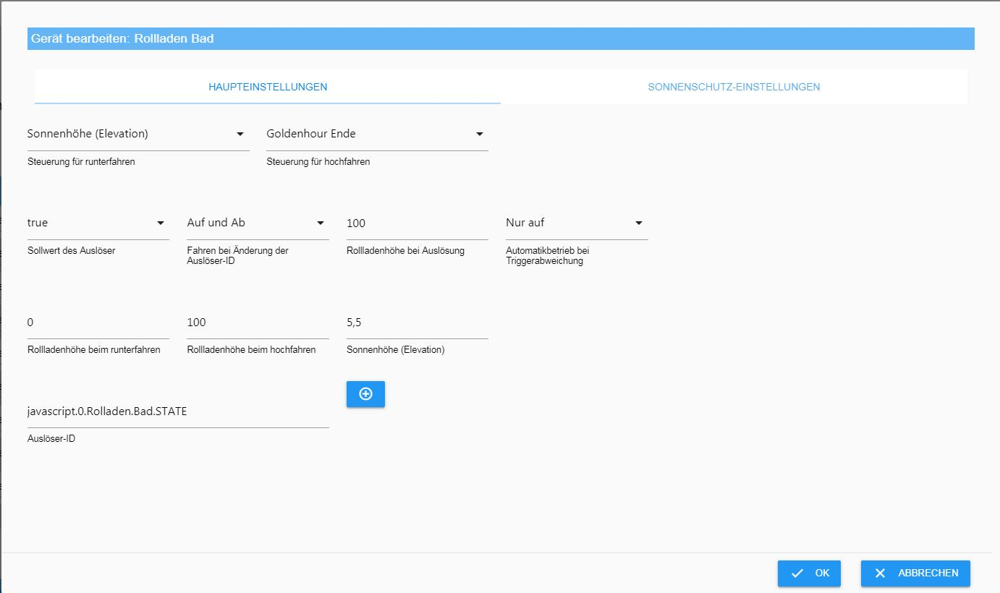
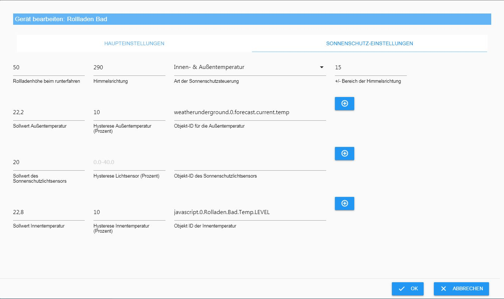

## Shuttercontrol is an adapter for the automatic control of roller shutters and awnings.

# Basic
As of version 0.2.11, all configuration data points are already preset with examples, so that the adapter is ready for operation after installation and entry of the IDs of the roller shutter actuators.
The further configuration then serves to adapt to personal wishes.

## installation
The adapter is already in the latest repository. In order to install it you have to set its active repository (temporarily) to latest in the basic settings of ioBroker.

At the latest after refreshing the adapter list the adapter **Shuttercontrol** is available.

After clicking the (+) an instance is created and the necessary data of the adapter is loaded from the repository:

# Configuration - Main Settings
If in the installation window the checkbox "***close when finished***" does not have to be ticked you have to close this course.

The configuration window consists of three tabs:
* Main settings
* Time settings
* Extra settings

The configuration window opens automatically with the main settings

An example ID is stored on this page.
Please delete these and then add your own IDs by clicking on the (+) on the top left of the table your own shutter actuators

Please select the data points with LEVEL (or similar). NOT the device as such.

After completion of the ID selection, the adapter is already ready for use, but not yet adapted to your own wishes.

### Structure of the table
No: consecutive number of the listed shutters
Active: Checkbox for activating the control of the corresponding roller shutter
Name: name of the actor; is automatically read from the objects when the ID is selected
Object ID Roller shutter: Unique ID of the data point to be controlled in the objects
(+): Add / change the ID
Pencil: specific configuration of the respective roller shutter
Arrows: change the order of the different shutters
Trash can: delete ID with all configured data!

## individual configuration of a roller shutter
This configuration level also consists of two tabs: main settings and sunshade settings

### Main Settings

In the upper area, the times are set for the up and down driving to the night darkness.
These times can be configured under ***Time Settings*** and selected here in pulldown.

The following options are available:

Explanations below.

**Trigger setpoint:** To enable lock-out protection, a trigger can be selected in the bottom line to prevent shutters from shutting down. Here, the value of the sensor is given, at which the roller shutter may drive.

**Driving on change:**Pulldown to select the function; only lockout protection, or even automatic reboot when opening; or just out.

**Roller shutter height when triggered:** If the roller shutter is to be moved when the sensor is triggered, the desired roller shutter position is entered here. (For example, windows 25% for ventilation, or 100% for doors to go through)

**Roller shutter height when moving down:** Desired roller shutter position when darkening

**Roller shutter height when raising:** desired roller shutter position in the morning

**Sun altitude:** If the darkening starts and ends at a fixed elevation, this value is entered here; otherwise leave empty.

**Trigger ID:** via which (+) select the sensor (State) which should prevent a roller shutter movement.

---
### Timing
**Off:** do not use originals

**Living area:** The shutters are driven as configured in the menu item Time settings / Living area.

**Living area (AUTO):** The shutters are operated as configured in the menu item Time settings / Living area. In addition, attention is paid to the trigger set under Extra settings. If this is set to false, the shutters will not be moved automatically

**Sleeping area:** The shutters are operated as configured in the menu item Time settings / Sleeping area.

**Sleeping area (AUTO):** The shutters are operated as configured in the menu item Time settings / sleeping area. In addition, attention is paid to the trigger set under Extra settings. If this is set to false, the shutters will not be moved automatically

**Sunset:** The shutters are driven at sunset to the darkening stage (when driving up here is analogous to the sunrise)

**Sun altitude:** If the elevation falls below the value set in the individual configuration, the shutters are moved

**Golden Hour:** This value is an astronomical term and lies before sunset. The term comes from photography, because the colors have a golden shimmer.

### sun protection settings
The sunscreen can be controlled by various mechanisms. In this case, an outside temperature, an internal temperature, the brightness and the sun or the like. be selected as a trigger for the shading and its end.

The fields in detail:
**Roller shutter height when driving down:** The value of how far the roller shutter should be closed during shading.

**Direction:**Alignment of the window on the wind rose (0 ° = north, 180 ° = south)

**+ / - Area of ​​compass:** Area in which the sun (around the center) would radiate disturbing into the window. Outside this area there is no shading.

**Type of sunshade control:** Pulldown to select different parameter combinations for shading control.

**Setpoint outside temperature:** threshold for starting the shading. Of course, this value depends on the sensor selected in the next field.

**Hysteresis outside temperature (percent):** Here, a hysteresis can be set in percent so that the roller shutter does not constantly go up and down in case of fluctuations

**Object ID for the outside temperature:** The sensor selected here does not necessarily have to measure the outside temperature. It can provide any value that can be used for shading. This can also be a heat sensor (temperature difference sensor).

**Setpoint of the light sensor:**Analogous to the outside temperature sensor

**Hysteresis light sensor (percent):** Here, a hysteresis can be set in percent so that the roller shutter does not constantly move up and down in the event of fluctuations

**Object ID of the light sensor:** Analogous to the outside temperature sensor; if not used leave empty

**Internal temperature sensor set point:** Here, a temperature of an indoor temperature sensor associated with the shutter can be inputted under which no shading is to take place, e.g. to use the heat radiation in winter for heating support.

**Hysteresis indoor temperature (percent):** Here a percentage hysteresis can be set so that the roller shutter does not constantly go up and down in the event of fluctuations

**Object ID of the indoor sensor:** via the (+) select the temperature sensor (state) which should prevent a roller shutter travel.

### tips:
If a shutter is adjusted manually and the position does not correspond to the automatically approached, the automatic switches off!

---

# Configuration - time settings
In this section, you can set some time or astro settings that can be selected in the individual roller shutter configurations.

## living area
In the upper section, the desired parameters for the shutters in the living area are entered.

**The pulldown** contains several basic variants

**Shut down during the week:** Usual time for blackout during the week

**Shut down on the weekend:** Usual time for the blackout on weekends and public holidays

**Start at the weekend:** Usual time for the end of the blackout on weekends and public holidays

**Min. Time to start the week:** Time must be at least exceeded with additional astro settings before the roller shutter starts in the morning

**Max. Time for booting up in the week:** Time that must be exceeded with additional astro settings highest, before the roller shutter starts in the morning. If the roller shutter should never start up when the sun has not yet reached a certain level, this time must be set to the latest time of this sun position (on 21.12.).

**Time delay of the shutters:** Distance of the start of the roller shutter movement of the individual blinds of this group to avoid radio interference, or to give the impression that they were driven manually.

## sleeping area

Everything that is written under living quarters is analogous here.
If the shutters in the two areas drive differently, you can enter this here.

### Tip:
Of course, this categorization does not necessarily have to be used for living and sleeping areas. Of course, these two presets can be completely freely implemented.

---

# Configuration - Extra Settings

In the Extra settings, various settings are applied that are used in the various configurations.

## Astro settings
These settings are actually self-explanatory: latitude and longitude of the place of residence to calculate the position of the sun correctly.

**Time delay:** Here an offset can be entered by which the roller shutter movements for up or down of the later selected astro events should evolve.

**Time delay for driving the shutters:**

**End sun protection with sun height:** In a building or near tall trees, the shading does not necessarily have to last until reaching the set azimuth. As soon as the sun falls below the altitude set here (and thus the neighboring buildings), the shading ends

## Extra settings

**Checking the current shutter status:** For some users (among other shelly users) the problem arises that the level changes again. For this reason there is a checkbox here. Should the checkbox be active, shuttercontroll will check the current level 1 minute after the last trip of the shutter and save it temporarily.

**Use of public holidays:** If the roller shutters are to be used on public holidays as well as on weekends, the checkbox is activated and an instance of the public holiday adapter is selected.
You can create two instances of the holiday adapter if necessary; a to display all possible holidays and a working time relevant holidays, which then access shuttercontrol.
