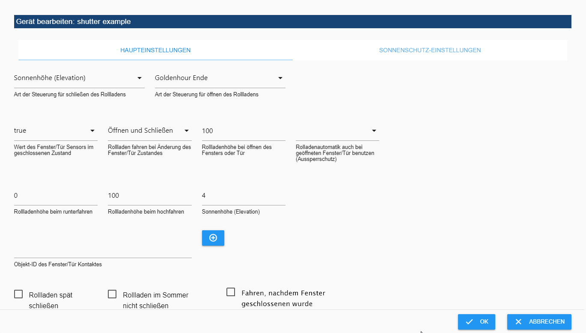
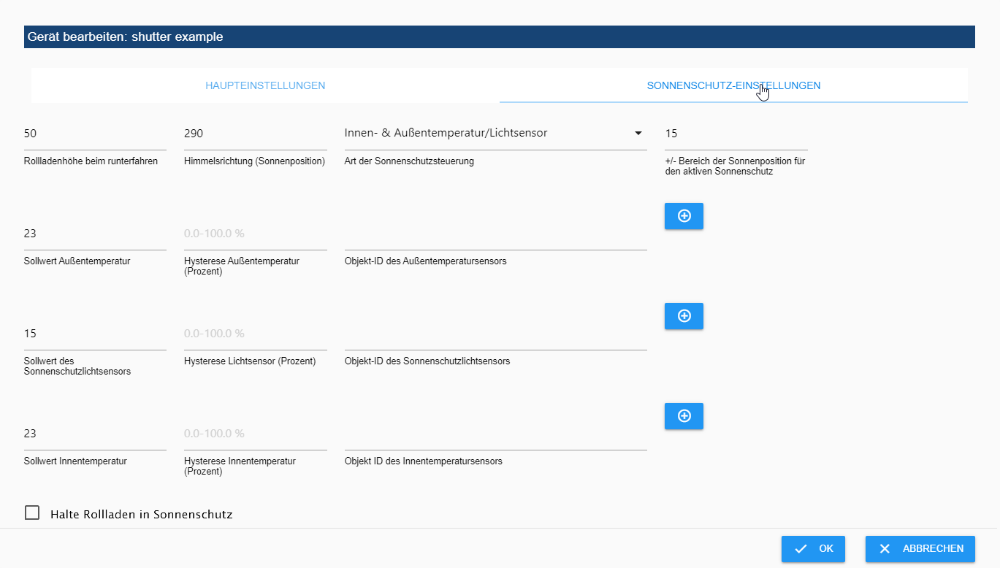

## Shuttercontrol is an adapter for the automatic control of roller shutters and awnings.

 

**If you like it, please consider a donation:**
  

# Basic
As of version 0.2.11, all configuration data points are already preset with examples, so that the adapter is ready for operation after installation and entry of the IDs of the roller shutter actuators.
The further configuration then serves to adapt to personal wishes.

> Shuttercontrol is able to work with actors which can be controlled over an position object like LEVEL with values from 0 to 100% or 0-255 respectivly. The needed shutter timing must be done by the according actor. Actor for blinds with 2 separated objecs for "hight" and "lid angle" are supported and can be controled by using 2 Objects with the same configuraiton (one for "hight" one for "lid angle"

> Attention: If the Shuttercontrol adaper is being restarted (Also after configuration changes) the shutters have to be initialized by moving them up with the button "openAll" (shuttercontrol.0.control.openAll), even they are already up! This will reinitialise all adapter internal values.

## installation
The adapter is already in the latest repository. In order to install it you have to set its active repository (temporarily) to latest in the basic settings of ioBroker.

At the latest after refreshing the adapter list the adapter **Shuttercontrol** is available.

After clicking the (+) an instance is created and the necessary data of the adapter is loaded from the repository:

# Configuration - Main Settings
If in the installation window the checkbox "***close when finished***" does not have to be ticked you have to close this course.

The configuration window consists of three tabs:
* Main settings
* Time settings
* Extra settings

The configuration window opens automatically with the main settings

An example ID is stored on this page.
Please delete these and then add your own IDs by clicking on the (+) on the top left of the table your own shutter actuators

Please select the data points with LEVEL (or similar). NOT the device as such.

After completion of the ID selection, the adapter is already ready for use, but not yet adapted to your own wishes.

### Structure of the table
No: consecutive number of the listed shutters
Active: Checkbox for activating the control of the corresponding roller shutter
Name: name of the actor; is automatically read from the objects when the ID is selected
Object ID Roller shutter: Unique ID of the data point to be controlled in the objects
(+): Add / change the ID
Pencil: specific configuration of the respective roller shutter
Arrows: change the order of the different shutters
Trash can: delete ID with all configured data!

## individual configuration of a roller shutter
This configuration level also consists of two tabs: main settings and sunshade settings

### Main Settings

In the upper area, the times are set for the up and down driving to the night darkness.
These times can be configured under ***Time Settings*** and selected here in pulldown.

The following options are available:

Explanations below.

**Trigger setpoint:** To enable lock-out protection, a trigger can be selected in the bottom line to prevent shutters from shutting down. Here, the value of the sensor is given, at which the roller shutter may drive.

* **off**:  No movement while opening the window
* **open**:  While opening the window, the shutter will open and will remain up after closing
* **close**:  After closing the window, the shutter will drive down
* **open and close:**  The shutter will open with opening the window and will drive down when the window is beeing closed

**Roller shutter height when triggered:** If the roller shutter is to be moved when the sensor is triggered, the desired roller shutter position is entered here. (For example, windows 25% for ventilation, or 100% for doors to go through)

**Driving on change:**Pulldown to select the lock-out protection function. It is taken into account, at the point in time, when the automatic is going to drive the shutter.
* **off**: lock-out protection is active in both ways, the shutters will not move if the window is open.
* **open**: drive up only. The shutter is alowed to open automatically, even the window is open, but the shutter will not be closed automatically, if the window is open.
* **close**: drive down only. The shutter is alowed to close automatically, even the window is open, but the shutter will not open automatically, if the window is open
* **open and close**: The shutter is allowed to drive up or down if the window is open.

**Roller shutter height when moving down:** Desired roller shutter position when darkening

**Roller shutter height when raising:** desired roller shutter position in the morning

**Sun altitude:** If the darkening starts and ends at a fixed elevation, this value is entered here; otherwise leave empty.

**Trigger ID:** via which (+) select the sensor (State) which should prevent a roller shutter movement.

---
### Timing
**Off:** do not use originals. Buttons for openAll/closeAll are still working

**only manual drive** the shutter is driven manually only in the configured direction. Buttons have no effect on shutters configured with this option. May helpful for awning, which shall not be moved togehter with the rest of the shutters.

**Living area:** The shutters are driven as configured in the menu item Time settings / Living area.

**Living area (AUTO):** The shutters are operated as configured in the menu item Time settings / Living area. In addition, attention is paid to the trigger set under Extra settings. If this is set to false, the shutters will not be moved automatically

**Sleeping area:** The shutters are operated as configured in the menu item Time settings / Sleeping area.

**Sleeping area (AUTO):** The shutters are operated as configured in the menu item Time settings / sleeping area. In addition, attention is paid to the trigger set under Extra settings. If this is set to false, the shutters will not be moved automatically

**Sunset:** The shutters are driven at sunset to the darkening stage (when driving up here is analogous to the sunrise)

**Sun altitude:** If the elevation falls below the value set in the individual configuration, the shutters are moved

**Golden Hour:** This value is an astronomical term and lies before sunset. The term comes from photography, because the colors have a golden shimmer.

**close roler shutters late:** With this option, the roller shutter is additionally shut down at a defined time (adjustable in the extra settings)

**do not close close shutters in summer:** some shutters should not be closed in summer. The period for this is specified in the extra settings.

**Drive to position after window has been closed:** This option has an effect only if the option "Driving on change" is not set to "off" It allows to move the shutter to the last called position after the window/door has been closed. A typical door configuration could be: Trigger: "open/close" ; Drive on change: "open" ; Drive to position after window has been closed: "enabled"

### Xmas settings
If the shutters should only be partially closed at Christmas time because the candle arches or similar should remain visible,
you can use this option.
With this option, the roller shutters are not moved completely at the normal closing time, but only to an adjustable level.
This level can be set in the respective roller shutter settings under "Roller shutter level at Christmas time". ** Attention: ** This value is
only visible if the checkmark for "Roller shutter level at Christmas time is used" is set. If the check mark is not set,
the option is deactivated.
This option is automatically activated in a certain period of time (e.g. from 01.12. To 10.01). The period can be set under "Extra settings"
and there "Xmas settings".
If you want to close the shutters completely later in the evening, you can use the option "All shutters close late at night" or "First move to an intermediate position and close later"
use. ** Attention: ** Both options can also be used independently of the Xmas settings.

### sun protection settings
The sunscreen can be controlled by various mechanisms. In this case, an outside temperature, an internal temperature, the brightness and the sun or the like. be selected as a trigger for the shading and its end.

The fields in detail:
**Roller shutter height when driving down:** The value of how far the roller shutter should be closed during shading.

**Direction:**Alignment of the window on the wind rose (0 ° = north, 180 ° = south)

**+ / - Area of ​​compass:** Area in which the sun (around the center) would radiate disturbing into the window. Outside this area there is no shading.

**Type of sunshade control:** Pulldown to select different parameter combinations for shading control. 
The following option are available:
* Indoor & outdoor temperature / light sensor
* Cardinal direction (sun position)
* Indoor / outdoor temperature / light sensor & compass direction
* Outside temperature / light sensor & compass direction
* Outside temperature / light sensor
* Indoor temperaturennentemperatur
 
>The sunprotection is only triggered, if all of the choosen parameters are true (AND operation).

>If a control with more than one parameter is needed, you need to chose the according shading control and configure the needed parameter. The light sensor is optional and will be counted if is configured..

>The sunprotection is beding ended, if one of the parameter is lower than configured.

**Setpoint outside temperature:** threshold for starting the shading. Of course, this value depends on the sensor selected in the next field.

**Hysteresis outside temperature (percent):** Here, a hysteresis can be set in percent so that the roller shutter does not constantly go up and down in case of fluctuations

**Object ID for the outside temperature:** The sensor selected here does not necessarily have to measure the outside temperature. It can provide any value that can be used for shading. This can also be a heat sensor (temperature difference sensor).

**Setpoint of the light sensor:**Analogous to the outside temperature sensor

**Hysteresis light sensor (percent):** Here, a hysteresis can be set in percent so that the roller shutter does not constantly move up and down in the event of fluctuations

**Object ID of the light sensor:** Analogous to the outside temperature sensor; if not used leave empty

**Internal temperature sensor set point:** Here, a temperature of an indoor temperature sensor associated with the shutter can be inputted under which no shading is to take place, e.g. to use the heat radiation in winter for heating support.

**Hysteresis indoor temperature (percent):** Here a percentage hysteresis can be set so that the roller shutter does not constantly go up and down in the event of fluctuations

**Object ID of the indoor sensor:** via the (+) select the temperature sensor (state) which should prevent a roller shutter travel.

**keep in sunprotect:** keeps the shutter in sunprotect mode until the shutter will be closed in the evening. This option can be helpful to prevent from moving up and down many times a day. If you use blinds, you may hold the hight with this option and just let open/close the blinds by controlling the angle.

### tips:
If a shutter is adjusted manually and the position does not correspond to the automatically approached, the automatic switches off!
Exception: Sunprotect works also if the shutter is opened manually to 100% for the first time per day. In this case, the roller shutter moves into the sun protection height shortly after being opened manually, if required.
If the roller shutter is opened automatically and the conditions for sun protection are met, it moves directly to the height of the sun protection.

---

# Configuration - time settings
In this section, you can set some time or astro settings that can be selected in the individual roller shutter configurations.

## living area
In the upper section, the desired parameters for the shutters in the living area are entered.

**The pulldown** contains several basic variants

**Shut down during the week:** Usual time for blackout during the week

**Shut down on the weekend:** Usual time for the blackout on weekends and public holidays

**Start at the weekend:** Usual time for the end of the blackout on weekends and public holidays

**Min. Time to start the week:** Time must be at least exceeded with additional astro settings before the roller shutter starts in the morning

**Max. Time for booting up in the week:** Time that must be exceeded with additional astro settings highest, before the roller shutter starts in the morning. If the roller shutter should never start up when the sun has not yet reached a certain level, this time must be set to the latest time of this sun position (on 21.12.).

**Time delay of the shutters:** Distance of the start of the roller shutter movement of the individual blinds of this group to avoid radio interference, or to give the impression that they were driven manually.

## sleeping area

Everything that is written under living quarters is analogous here.
If the shutters in the two areas drive differently, you can enter this here.

### Tip:
Of course, this categorization does not necessarily have to be used for living and sleeping areas. Of course, these two presets can be completely freely implemented.

---

# Configuration - Extra Settings

In the Extra settings, various settings are applied that are used in the various configurations.

## Astro settings
These settings are actually self-explanatory: latitude and longitude of the place of residence to calculate the position of the sun correctly.

**Time delay:** Here an offset can be entered by which the roller shutter movements for up or down of the later selected astro events should evolve.

**Time delay for driving the shutters:** So that not all shutters drive at the same time, a time in seconds for a delay can be set here.

**End sun protection with sun height:** In a building or near tall trees, the shading does not necessarily have to last until reaching the set azimuth. As soon as the sun falls below the altitude set here (and thus the neighboring buildings), the shading ends

## Extra settings

**Checking the current shutter status:** For some users (among other shelly users) the problem arises that the level changes again. For this reason there is a checkbox here. Should the checkbox be active, shuttercontroll will check the current level 1 minute after the last trip of the shutter and save it temporarily.

**Use of public holidays:** If the roller shutters are to be used on public holidays as well as on weekends, the checkbox is activated and an instance of the public holiday adapter is selected.
You can create two instances of the holiday adapter if necessary; a to display all possible holidays and a working time relevant holidays, which then access shuttercontrol.

**Object ID for setting the vacation** this Object-ID sets internal state "Holiday". You could use a datapoint from iCal-Adapter

**Object ID of the trigger for the sleeping area (auto):** With this trigger, the automatic mode of the sleeping area can be activated.

**Object ID of the trigger for the living area (auto):** With this trigger, the automatic mode of the living area can be activated.

**All shutters close late at night** With this option, all roller shutters can be lowered again late in the evening. This covers the scenario if the window or door was still open at the normal time for the shutdown, or if the terrace door was opened again after the shutdown. You can deactivate this option separately in the respective shutter settings

**Time when all shutters close late at night** Time when all roller shutters should be shut down again in the evening (e.g. 10:30 p.m.)

** Beginning of summer ** Start of the period when shutters are not shut down in summer.
** end of the summer ** End of the period in which roller shutters are not shut down in summer.
Which roller shutters are not shut down in summer can be specified in the respective roller shutter settings.

---
### Alarm-Settings

Shuttercontrol knows the following alarms. You can configure for each alarm an according logical datapoint (true/false)
status true = Alarm is active
Status false = Alarm is NOT activ
Furthermore, for each alarm you can define a level, where the rollos has to drive to, once the alarm is being activated.
To activate the defined alarm for a certain rollo, please go to the rollo specific settings in the menu extra - alarm settings.

Available alarms:
- Wind 1
- Wind 2
- Rain
- Frost
- Fire / Burglar

Alarm priorities:
Prio 1 --	Fire- / Burglaralarm: Highest priority has the Fire / Burglar alarm. If it once has been activated, the roller which has been configured
			to listen will drive to the configured level. The roller are then blocked and will NOT move back even the Fire alarm signal is taken back
			to state false. To get back to normal operation, the roller need to be re-initialized with the buttons "openAll" / "closeAll".
			With this behaviour it will be ensured that in case of fire stay open in any case and emergency exits stay open or the access for fire fighters
			is ensured.

Prio 2 - 5	Rain, Wind2, Wind1, Frost: All of these alarms have the same priority when they get activatet. Means, the roller will move to the last activated alarm level.
			However, if an Alarm is being deactivated, the following priorities are set fix, if another alarm is still pending. 
			Prio 1 = Fire / Burglar
			Prio 2 = Rain
			Prio 3 = Wind 2
			Prio 4 = Wind 1
			Prio 5 = Frost

Frost alarm is only moving directly out of the down position. (to prevent freezing down the roller)
If the frost alarm is being activated while the roller is in up-position the roller will not move immeadetly but the roller will move to the frost position, once it's going to close.

### Trigger-Settings

**Delay roller shutter up when window is opened (s)**
Parameter to delay the roller open after the window has been opened (seconds)

**Delay roller shutter down when window is closed (s)**
Parameter to delay the roll close after the window has been closed (seconds)

**Delay until end of sunprotection**
With this settings (in Minutes) it can be defined for how long the Roller will stay in sunprotect mode
eventhough no sunprotection is required anymore by the light sensor (value below the defined hystresis).
If there is a new sunprotection required during this time, the timer will be reseted and restarted once 
the light sensor value falls again under the defined light value hystresis.
This setting can be helpfull to prevent moving up and down while the weather is often changing (cloudy)

**Alarm Settings**
With this setting the predefined alarm (Alarm setting in Main-Extra Menü) shall be acitvated for this 
particular Rollo. 